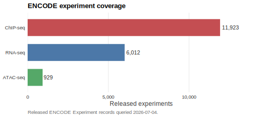
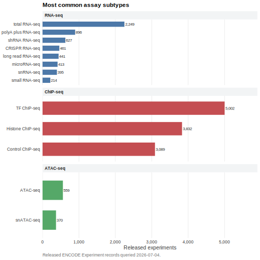
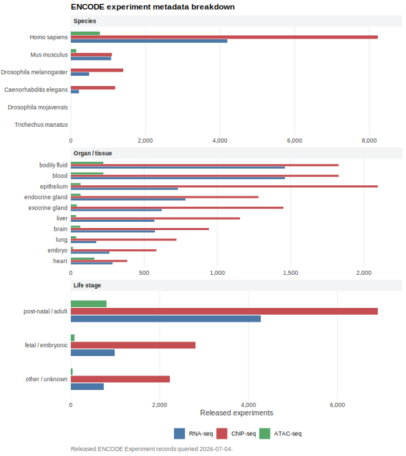
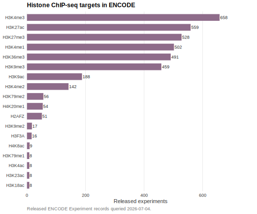

# encodeUtils

`encodeUtils` queries ENCODE metadata from R and helps choose, download, read,
and record the files used in an analysis.

The package is read-only. It searches ENCODE, lists file metadata, checks
downloads, downloads selected files, reads supported local files, and records
provenance. It does not submit or modify ENCODE records.

## ENCODE Overview

These summaries show released ENCODE Experiment records for common sequencing
workflows.









Regenerate the figures with:

```r
source("scripts/plot_encode_database_summary.R")
```

## Installation

```r
# install.packages("pak")
pak::pak("ZohebKhan1/encodeUtils")
```

## Workflow

Most analyses use the same sequence:

1. Search ENCODE records with `encode_search()`.
2. Extract the displayed table with `encode_results()` when needed.
3. List files for selected experiments with `encode_list_files()`.
4. Select files with `encode_select_files()`.
5. Check file paths and sizes with `encode_download(dry_run = TRUE)`.
6. Download with `encode_download()`.
7. Read supported downloaded files with `encode_read()` or `encode_download(read = TRUE)`.
8. Save provenance with `encode_manifest()`.

## Example

```r
library(encodeUtils)

experiments <- encode_search(
  type = "Experiment",
  search = "mouse heart total RNA-seq",
  status = "released",
  limit = 10
)

files <- encode_list_files(
  experiments,
  file_format = "tsv",
  output_type = "gene quantifications",
  assembly = "mm10"
)

dry_run <- encode_download(
  files,
  file_accession = c("ENCFF260OJQ", "ENCFF090VKE"),
  directory = tempdir(),
  dry_run = TRUE
)

downloaded <- encode_download(
  files,
  file_accession = c("ENCFF260OJQ", "ENCFF090VKE"),
  directory = "data/encode/rna-seq"
)

loaded <- encode_read(downloaded)

manifest <- encode_manifest(
  downloaded,
  include_session = FALSE,
  path = file.path(tempdir(), "encode-rna-manifest.json")
)
```

## Main Functions

- `encode_search()` finds ENCODE experiments, files, and other records.
- `encode_results()` extracts the main table from result objects.
- `encode_list_files()` lists files attached to experiments.
- `encode_select_files()` selects files by accession, format, output type, or preset.
- `encode_explain_selection()` shows why files were selected or excluded.
- `encode_download()` checks, downloads, and can optionally read selected files.
- `encode_read()` reads supported local ENCODE files or downloaded file tables.
- `encode_manifest()` records queries, selected files, downloads, and ENCODE attribution metadata.

## Additional Helpers

- `encode_get()` retrieves one ENCODE record by accession, path, or URL.
- `encode_matrix()` summarizes ENCODE record counts by assay and biosample.
- `encode_preview_download()` is retained for older code that wants a separate plan object.

## References

- ENCODE REST API: <https://www.encodeproject.org/help/rest-api/>
- ENCODE Search: <https://www.encodeproject.org/search/>
- ENCODE Matrix: <https://www.encodeproject.org/matrix/>
- ENCODE attribution guidance: <https://www.encodeproject.org/help/citing-encode/>
