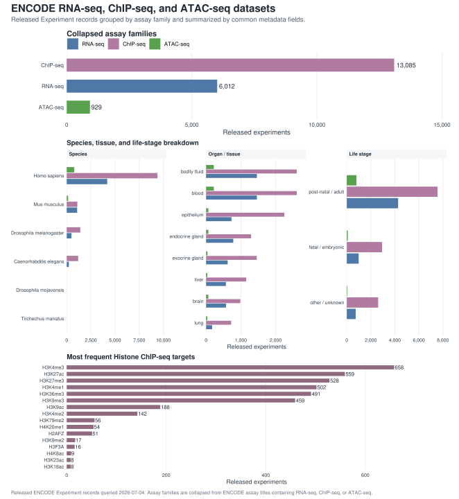

# encodeUtils

[](https://github.com/ZohebKhan1/encodeUtils/actions/workflows/R-CMD-check.yaml)
[](https://github.com/ZohebKhan1/encodeUtils/actions/workflows/pkgdown.yaml)
[](https://github.com/ZohebKhan1/encodeUtils/actions/workflows/R-CMD-check.yaml)
[](https://app.codecov.io/gh/ZohebKhan1/encodeUtils)
[](https://www.repostatus.org/#active)
[](https://github.com/ZohebKhan1/encodeUtils/commits/main)
[](https://github.com/ZohebKhan1/encodeUtils/stargazers)
[](https://github.com/ZohebKhan1/encodeUtils/network/members)

`encodeUtils` is an unofficial R package for convenient, traceable analysis of
ENCODE datasets. It queries the
[ENCODE REST API](https://www.encodeproject.org/help/rest-api/), parses the
JSON returned by experiment and file searches, and turns ENCODE Portal metadata
into analysis-ready file tables with accessions, assay, biosample, organism,
target, assembly, output type, file size, checksums, and download URLs.

This package can be used to search RNA-seq, ChIP-seq, and ATAC-seq experiments,
list files from ENCODE accessions, select common outputs such as RNA-seq gene
quantification tables, ChIP-seq peaks or signal tracks, and ATAC-seq peaks,
preview downloads before transfer, load supported files into native R objects,
and write traceable logs/citations. The returned tables and objects are
intended to fit directly into downstream R and Bioconductor workflows with
packages such as `rtracklayer`, `ChIPpeakAnno`, `edgeR`, `DESeq2`, and
`GenomicRanges`.

This package is not officially affiliated with the ENCODE Project. It started
as a personal research utility to make ENCODE data discovery and R-based
analysis faster and easier for my own workflows.

## ENCODE REST API background

The ENCODE Portal exposes records through ordinary URLs. An accession such as a
biosample, experiment, or file can be requested over HTTP, and the response can
be returned as JSON. `encodeUtils` wraps that process from R: it sends GET
requests, parses the JSON response, flattens nested ENCODE fields into useful
tables, and keeps enough metadata to trace which records and files were used.

For debugging or learning the underlying API, two tools are helpful:

- A browser JSON viewer, such as JSONView for Chrome or Firefox, or json-lite
  for Safari.
- `curl`, which is included with macOS and most Linux/Unix systems. If it is
  not installed, use an SSL-aware build from the curl project.

For example, this command requests a biosample record as JSON:

```sh
curl -H "Accept: application/json" \
  https://www.encodeproject.org/biosamples/ENCBS000AAA/
```

The same idea is used by scripts: build a URL for an ENCODE object or search
endpoint, request JSON, parse it, and convert it into native data structures.
In `encodeUtils`, those native structures are R lists, data frames, file tables,
and analysis-ready objects.

The ENCODE REST API documentation asks programmatic users to stay at or below
10 GET requests per second for a single user, group, company, or lab. Exceeding
that limit can lead to IP-based blocking. `encodeUtils` uses a conservative
default throttle of 5 requests per second; advanced users can change it with
`options(encodeUtils.rate_per_second = ...)`.

## ENCODE Overview

These summaries show released ENCODE Experiment records for common sequencing
workflows.



## Installation

Install the current package from GitHub:

```r
if (!requireNamespace("pak", quietly = TRUE)) {
  install.packages("pak")
}

pak::pak("ZohebKhan1/encodeUtils")
```

## Workflow

Most analyses use the same sequence:

1. Search ENCODE records with `encode_search()`.
2. Extract the displayed table with `encode_results()` when needed.
3. List files for selected experiments with `encode_list_files()`.
4. Select files with `encode_select_files()`.
5. Check file paths and sizes with `encode_download(dry_run = TRUE)`.
6. Download with `encode_download()`, or use `encode_download(read = TRUE)` to
   download and read supported files in one step.
7. Use the returned metadata and data matrices in R.
8. Save provenance with `encode_manifest()`.

Printed ENCODE file tables show a compact canonical subset by default:
`file_accession`, `experiment_accession`, `assay_title`, `organism`,
`biosample_term_name`, `file_format`, `output_type`, `assembly`, file size, and
status. Use `encode_results()` to recover the full metadata table for filtering,
joins, or audit trails.

Common columns to use in scripts:

- `file_accession`: stable ENCODE file identifier.
- `experiment_accession`: parent ENCODE experiment identifier.
- `organism` and `biosample_term_name`: species and sample identity.
- `file_format`, `output_type`, and `assembly`: file-selection fields.
- `file_size`, `md5sum`, `download_url`, and `local_path`: download planning,
  verification, and provenance fields.

## Example

```r
library(encodeUtils)

experiments <- encode_search(
  type = "Experiment",
  organism = "mouse",
  assay = "rna-seq",
  biosample = "heart",
  status = "released",
  limit = 10
)

files <- encode_list_files(
  experiments,
  file_format = "tsv",
  output_type = "gene quantifications",
  assembly = "mm10"
)

rna_files <- encode_results(files)
rna_files <- rna_files[seq_len(min(2, nrow(rna_files))), ]

dry_run <- encode_download(
  rna_files,
  directory = tempdir(),
  dry_run = TRUE
)

# Run the same call without dry_run = TRUE to transfer the selected files.
# directory = NULL uses the package cache under tools::R_user_dir().
# downloaded <- encode_download(rna_files, directory = NULL)
# loaded <- encode_read(downloaded, values = c("raw_counts", "TPM"))

manifest <- encode_manifest(
  dry_run,
  include_session = FALSE,
  path = file.path(tempdir(), "encode-rna-manifest.json")
)
```

For ChIP-seq searches, use `exclude_controls = TRUE` when you want target
experiments and not input-control experiments:

```r
chip_experiments <- encode_search(
  type = "Experiment",
  organism = "mouse",
  assay = "histone chip-seq",
  organ = "heart",
  target = "H3K27ac",
  exclude_controls = TRUE,
  limit = 10
)
```

`directory = NULL` uses `tools::R_user_dir("encodeUtils", "cache")`, so users
can rely on a standard R user-cache location instead of writing downloads into a
package source tree, working directory, or home-directory example path. Set
`cache = FALSE` or `directory = tempdir()` for non-persistent downloads. A
single local path or one downloaded-file row returns the native object
for that file. A multi-row downloaded-file table returns an `encode_loaded_files`
collection. Its primary components are `metadata`, `data`, `matrices`, and
`by_experiment`. The `files`, `raw_counts`, and `tpm` components are convenience
aliases for `metadata`, `matrices$raw_counts`, and `matrices$TPM` when those
objects are available. Use `encode_read(downloaded, as_collection = TRUE)` when
one-row and multi-row downloaded tables should return the same collection shape.

BED-like interval files are returned as `GRanges` when the optional genomic
reader stack can parse the file; ENCODE peak files with extra nonstandard
columns may fall back to a plain table unless `as = "GRanges"` is requested. Use
`encode_read(path, as = "data.frame")` for a plain table. FASTQ and alignment
files are returned as paths by default because downstream read processing is
usually handled by tools such as `ShortRead`, `Rsamtools`, or
`GenomicAlignments`.

## References

- ENCODE REST API: <https://www.encodeproject.org/help/rest-api/>
- ENCODE attribution guidance: <https://www.encodeproject.org/help/citing-encode/>
- Kagda MS, Lam B, Litton C, Small C, Sloan CA, Spragins E, Tanaka F, Whaling I, Gabdank I, Youngworth I, Strattan JS, Hilton J, Jou J, Au J, Lee JW, Andreeva K, Graham K, Lin K, Simison M, Jolanki O, Sud P, Assis P, Adenekan P, Miyasato S, Zhong W, Luo Y, Myers Z, Cherry JM, Hitz BC. Data navigation on the ENCODE portal. Nat Commun. 2025;16:9592. doi: 10.1038/s41467-025-64343-9.
